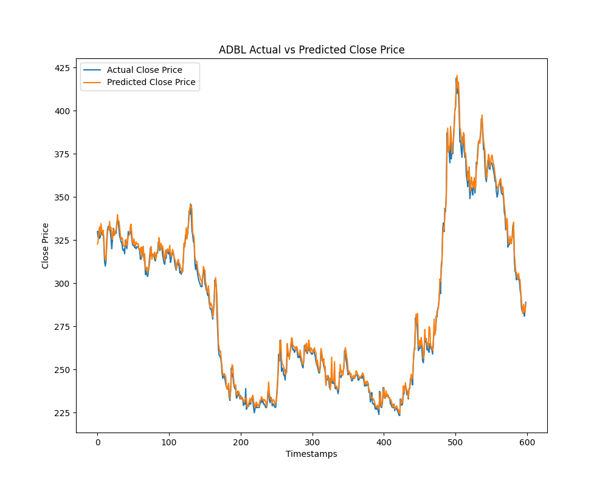

## Result

1. SVR

```
svr = SVR(kernel='linear', C=0.1)
```

gives result

```
Training Set Metrics:
  MSE: 29.7533, RMSE: 5.4547, MAE: 3.6663, R²: 0.9987
Test Set Metrics:
  MSE: 12.3370, RMSE: 3.5124, MAE: 2.6938, R²: 0.9948
```




2. Decision Tree Regressor

```
DecisionTreeRegressor(random_state=42)
```

```
Training Set Metrics:
  MSE: 0.0000, RMSE: 0.0000, MAE: 0.0000, R²: 1.0000
Test Set Metrics:
  MSE: 30.8991, RMSE: 5.5587, MAE: 4.1411, R²: 0.9869
```


3. Random Forest Regressor
```
RandomForestRegressor(n_estimators=100, random_state=42)
```

```
Training Set Metrics:
  MSE: 5.0360, RMSE: 2.2441, MAE: 1.3722, R²: 0.9998
Test Set Metrics:
  MSE: 13.8255, RMSE: 3.7183, MAE: 2.7842, R²: 0.9942
```


## Conclusion
We got best metrics from the `RandomForestRegressor(n_estimators=100, random_state=42)`.

With training and test metrics as:

```
Training Set Metrics:
  MSE: 5.0360, RMSE: 2.2441, MAE: 1.3722, R²: 0.9998
Test Set Metrics:
  MSE: 13.8255, RMSE: 3.7183, MAE: 2.7842, R²: 0.9942
```