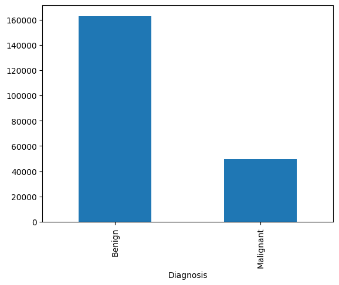
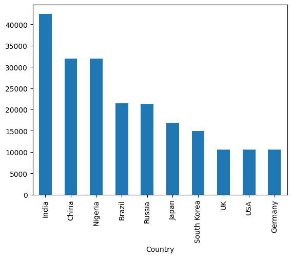
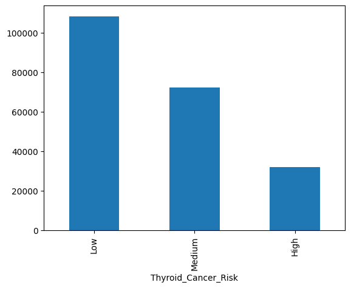
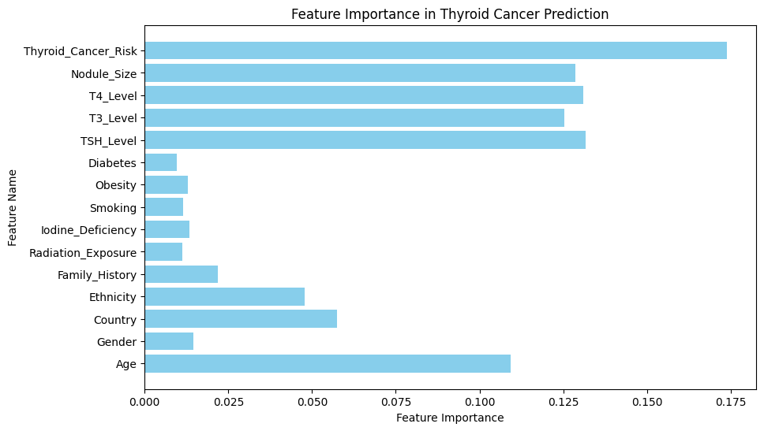

## Exploratory Data Analysis

There are 212691 rows/samples in the dataset and total number of features are 17.

### 1. There is no any missing value in the dataset.

### 2. Columns types
* numerical columns: 'Patient_ID', 'Age', 'TSH_Level', 'T3_Level', 'T4_Level', 'Nodule_Size'
* categorical columns: 'Gender', 'Country', 'Ethnicity', 'Family_History',
       'Radiation_Exposure', 'Iodine_Deficiency', 'Smoking', 'Obesity',
       'Diabetes',  'Thyroid_Cancer_Risk'
* target column: 'Diagnosis' (binary value: Benign, Maglinant)

### 3. The dataset is highly imbalanced 

we can see highly imbalanced class, with much more samples in the 'Benign' class.



*counts*

Benign       163196

Malignant     49495

*Highly imbalanced class, need to be balanced (with SMOTE)*

### 4. Country wise sample count
From the figure below it is clear that most of the samples are from India.




### 5. Thyroid Cancer Risk

We can see that most of the samples have low thyroid cancer risk.




### 6. Diagnosis Column


## Training

### Preprocessing
1. column `Patient_ID` is dropped, since it does not contribute to diagnosis.
2.  ordinal column `Thyroid_Cancer_Risk` is mapped to numerical value as follows:
```
# Encode ordinal column
risk_mapping = {"Low": 0, "Medium": 1, "High": 2}
df["Thyroid_Cancer_Risk"] = df["Thyroid_Cancer_Risk"].map(risk_mapping)
```

3. categorical columns encode with `LabelEncoder` so that for every unique category unique number (either of 0 to num_of_unique_category)
will be assigned:
```
# Encode categorical features and save encoders
categorical_cols = ["Gender", "Country", "Ethnicity", "Family_History", "Radiation_Exposure", 
                     "Iodine_Deficiency", "Smoking", "Obesity", "Diabetes"]

encoders = {}
for col in categorical_cols:
    le = LabelEncoder()
    df[col] = le.fit_transform(df[col])
    encoders[col] = le
```
4. Label is also done label encoding
```
# Encode target variable
df["Diagnosis"] = df["Diagnosis"].map({"Benign": 0, "Malignant": 1})
```
5. The dataset is splitted into train and test with 20 % data for test and then the class imbalance is handled by the `SMOTE` class 
from module `imblearn` for only train set so as to prevent the data leakage.
6. Satandardization is done with the `StandardScaler` to make all the numerical values in each columns to zero mean and unit variance.
7. finally we have trained two model: `RandomForestClassifier` and `LogisticRegression`. (w/o hyperparameter tuning)
8. Metrics: precision, recall, f1-score, ROC-AUC score, and confusion matrix are computed to measure model performance.

###  Result
**RandomForestClassifier**
```
             precision    recall  f1-score   support

           0       0.85      0.94      0.89     32615
           1       0.69      0.44      0.54      9924

    accuracy                           0.82     42539
   macro avg       0.77      0.69      0.71     42539
weighted avg       0.81      0.82      0.81     42539

ROC-AUC Score: 0.6935718867964985
Confusion Matrix:
 [[30696  1919]
 [ 5561  4363]]
```

**LogisticRegression**
```
              precision    recall  f1-score   support

           0       0.85      0.94      0.89     32615
           1       0.69      0.43      0.53      9924

    accuracy                           0.82     42539
   macro avg       0.77      0.69      0.71     42539
weighted avg       0.81      0.82      0.81     42539

ROC-AUC Score: 0.6943440050871369
Confusion Matrix:
 [[30720  1895]
 [ 5624  4300]]
```

**Result Interpretation**

Both model have same accuracy.

precision and recall for the class 0 (i.e., Benign) is relatively okay (precision=0.85, recall=0.94) whereas

precision and recall for class 1 (i.e., Maglinant) is very less (precision=0.69, recall=0.44/0.43).

### Conclusion
Since both models (w/o hyperparameter tuning) have almost same result, so we prefer the `LogisticRegression` model for 
being simplicity, and faster.

### Feature Importance
Feature importance by `RandomForestClassifier`.

We can see that features: `'Thyroid_Cancer_Risk', 'TSH_Level', 'T4_Level', 'Nodule_Size', 'T3_Level', 'Age'` are most dominant features
that guide the predictor to come to diagnosis. 




### Model Serving via API
We have created the API via FastAPI framework to serve the model for model inference or using model. The basic front-end is created with HTML 
with javascript; no any added fancy UI only for testing, whether API is working correctly or not.

The screenshot of the result is as follows:


### Future Work
* The future work could be to examine other models, as well as hyperparameter tuning for optimizing the selected best model.
* Feature selection could be another work, which helps to reduce number of less important or less contributing feature for the
predictive model.
* Also compute the SHAP value for more modle interpretability.

